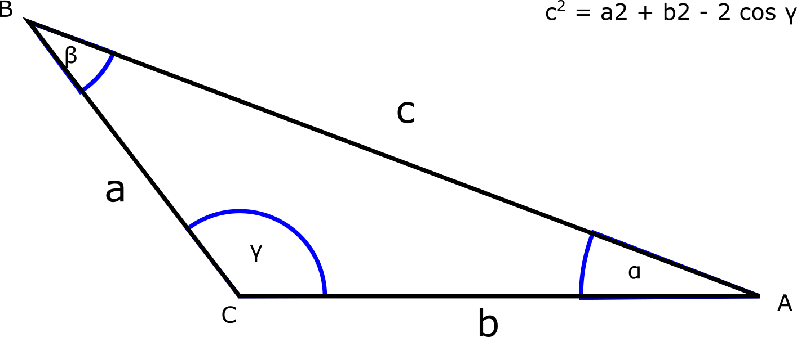

# Háromszög

Írj programot, ami a szabványos bemeneten a felhasználótól bekéri a **gamma** szöget, valamint az **a** és **b** oldalakat. 
Ezt követően a cosinus és a sinus tétel segítségével kiszámolja a **c** oldalt és a maradék két szöget, **alfát** és **bétát**.
A kiszámított eredményeket írja ki a szabványos kimenetre. 
A megoldáshoz érdemes használni a math.h library-t. 
A szögek fokokban legyenek. (Szükség esetén váltsd át radiánba.)

*Beadási határidő:* 2018.09.19, labor kezdetéig
