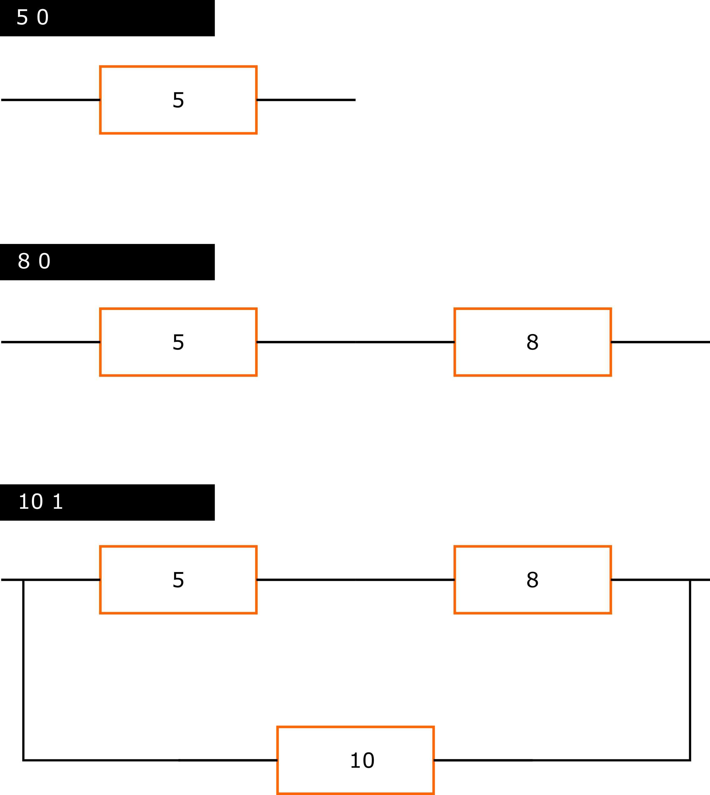

# Eredő ellenállás számítása

Ebben a feladatban egy olyan program megvalósítása lenne a cél, ami képes eredő ellenállást számolni
egy áramkörben levő ellenállásokra. A program a szabványos bemeneten megkap egy új ellenállást és azt, hogy az 
párhuzamosan vagy sorosan van e kapcsolva az eddig már felépített rendszerhez. Ezt követően kiszámolja az 
aktuális eredő ellenállást. A felhasználó megfelelő módon tudja jelezni, hogy most már végzett. Ekkor az
eredményt kiírja a képernyőre. Fontos a hibakezelés. legyen továbbá lehetséges reset-elni (előlről kezdeni), illetve
egyet visszalépni, de sorozatos visszalépés nem lehet.

Alább a részletek következnek.

Bemenet:
* ellenállás soros kapcsolásakor ez legyen a bemenet a képernyőn: R 0
* ellenállás párhuzamos kapcsolásakor: R 1
* ha kész van: NA -3
* reset: NA -2
* egyet visszalépni (utolsó ellenállás levétele): NA -1  
R az új bekötendő ellenállás értéke, míg utána szóközzel elválasztva, hogy soros (0) vagy párhuzamos (1) bekötés jön. NA azt jelenti, nem számít az értéke.

Hibakezelés:
* nem pozitív ellenállás esetén: írja ki, hogy az ellenállás negatív. A program ezután kínálja fel újra
az ellenállás csatolás lehetőségét.
* nem létező kapcsolási mód esetén: írja, ki hogy érvénytelen bekötési mód. A program ezután kínálja fel újra
az ellenállás csatolás lehetőségét.

Példa a bemenet használatra:

**Teszt:**

Bemenetek: (10 0) (8 0) (3 1) (20 0) (4.8 1) (3.9 0) (4.1 0)  
Elvárt kimenet: 11.9582

*Feltöltendő:* csak a forráskód egy .c kiterjesztésű fájlban, feltöltés a moodle-ben a 3. labor szorgalmi feladatához  
*Beadási határidő:* 2018.09.26, labor kezdetéig
