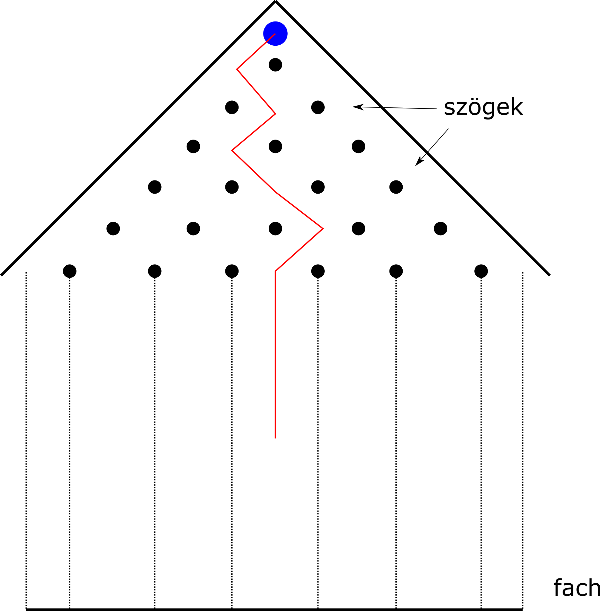
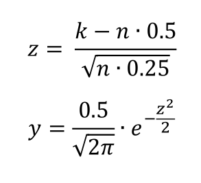

# Galton tábla

A [Galton tábla](https://en.wikipedia.org/wiki/Bean_machine) egy olyan függőleges tábla, amin az ábrán látható elrendezés szerint helyezkednek el szögek. A háromszög csúcsánál belép egy gyöngy. Ezt követően véletlenszerűen balra vagy jobbra esik tovább. A következő szögnél szintén véletlenszerűen balra vagy jobbra halad tovább. Minden szögnél az oda érkező golyóknak átlagosan a fele megy balra, illetve a másik fele jobbra. A kék kör egy gyöngyöt jelöl, a piros törött vonal egy lehetséges pályát, ahogy a szögek között pattog és beér egy fachba. A szagatott vonalak a fachok határait jelölik, ahova a gyöngyök eshetnek.

A legutolsó szögsor után a gyöngyök egy fachba esnek. Ahogy egyre több gyöngy halad át a táblán az egyes fachokban eltérő számú gyolyó lesz. 

A feladat, hogy szimuláljuk le, mennyi gyöngy lesz az egyes fachokban, ha a táblán áthaladó golyók száma 500000 illetve 19 sor szög van. Ábrázoljuk, hogy milyen alakú a gyönyök által kirajzolt eloszlás. A szabványos kimeneten minden sor egy fachot reprezentál, jelölje * a gyöngyöket, de a csillagok száma legyen: 
80 * gyöngyök_száma_a_fachban / összes_gyöngy .

Végül hasonlítsd ezt össze egy normál eloszlással, úgy hogy kirajzolod a normál eloszlást. 
Szintén a sorok szimbolizálják az x tengelyt. Itt legyen k a fach indexe. Ekkor a használandó képlet lent látható. Esetünkben **n** 20-al egyenlő. Ábrázolásnál érdemes az y 20-szorosát venni.

*Feltöltendő:* csak a forráskód egy .c kiterjesztésű fájlban, feltöltés a moodle-ben a 4. labor szorgalmi feladatához  
*Beadási határidő:* 2018.10.03, labor kezdetéig
