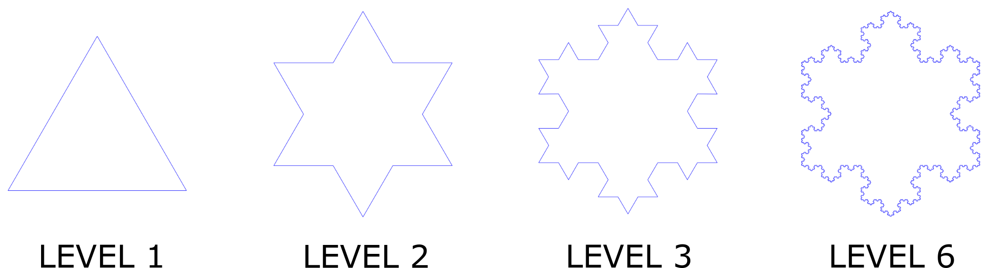

# Háromszög fraktál

Az alábbi ábrák, példák háromszög fraktálokra. A fraktál lényege az önhasonlóság. 
Egy szabályos háromszögből indulunk ki (1. szint), majd minden újabb szinten, az előző szinten levő háromszög 
minden oldalára elhelyezünk egy szabályos háromszöget, melynek oldala harmada az eredeti háromszögnek, elhelyezkedése pedig szimmetrikus.

A feladat ennek reprodukálása. A rajzolás svg fájlba történik, ami például a böngészővel (off-line is) megnyitható. 
A cél egy olyan program, ami tetszőleges szintig képes kirajzolni a fraktált. (Mivel nem tanultunk dinamikus tömböt, 
ezért maximalizálhatjuk a szintek számát 6-ban.) 

Az svg fájl előállításához segítséget nyújt a draw_fractal.h és .c fájlok. A megfelelő fügvény helyes hívása után egy 
fractal.svg nevű fájl fog keletkezni a VS project egyik almappájában (Az IDE-ből nem fogod látni a fájl, külön meg kell keresni.). 
A használathoz példa az example.c. Lényegében a header fájl által biztosított függvény, a fraktál csúcsainak koordinátáit várja, 
egy rögzített körüljárásiirány szerint (például óramutatóval egyező). 

A koordináta rendszer elhelyezkedése a képernyőhöz viszonyítva: 
- y: függőlegesen lefelé mutat 
- x: vízszintesen jobbra.

A megfelelő méretekről és elhelyezkedésről a megoldás során gondoskodni kell. Próbálj meg esztétikus eredményt, ábrát elérni. 
Ehhez a draw_fractal fájlokat ne módosítsd!

Viszont módosítsd a kirajzolandó vonalak színét a jelenlegi (kéktől) eltérőre. 
Ehhez leírás az svg fájlról ezen a linken, [SVG]( https://www.w3.org/TR/SVG2/shapes.html#LineElement ), található.

*Feltöltendő:* csak a forráskód egy .c kiterjesztésű fájlban ÉS egy svg file a 6-os szinthez tartozó fraktállal, feltöltés a moodle-ben az 5. labor szorgalmi feladatához  
*Beadási határidő:* 2018.10.17, labor kezdetéig
