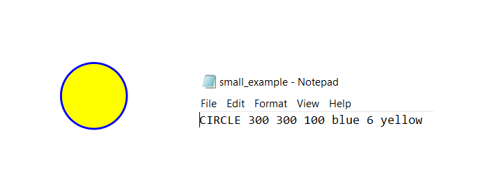

# Rajzoló program
Ebben a feladatban az egyik korábbi feladatban (Fraktál) használt svg fájlhoz hasonló generálása a cél 
egy egyszerű leíró fájl segítségével. A leíró fájlban különböző alakzatok szerpelehetnek, minden sorban 
egy-egy alakzat leírása található. A megvalósítandó programnak az alábbi egyszerű alakzatokat kell tudnia támogatni: 
* pont, fájlban: POINT x_koordináta y_koordináta pont_színe
* egyenes, fájlban: LINE x1_kezdőpont y1 x2_végpont y2 vonalszín vonalvastagság
* téglalap, fájlban: RECTANGLE x_bal_felső_sarok y_bal_felső magasság szélesség keretszín keretvastagság kitöltési_szín
* kör, fájlban: CIRCLE x_centrum y_centrum sugár keretszín keretvastagság kitöltési_szín
* ellipszis, fájlban: ELLIPSE x_centrum y_centrum x_fél_tengely_hossz y_féltengely_hossz keretszín keretvastagság kitöltési_szín

A feladat egy olyan program elkészítése, ami beolvassa a leíró fájlt (description.txt) és ebből generál egy megfelelő svg-t. 
Az egyes alakzatok svg fájlban való kódolására [ezen a honlapon]( https://www.w3schools.com/graphics/svg_intro.asp) érhetők 
el a pontos leírások.

(Megjegyzés: a színek megadása lehetséges név illetve rgb(.,.,.) formátumokban, ahol a pontok egy számra utalnak 0 és 255 között. 
Kezeld mindkettőt úgy, mint egy sztringet! Emiatt az utóbbi formátumnál nincs szóköz a számok között.)

A feladat mellé egy txt-t is csatoltam, ami egy példa leíró fájl. Helyes feldolgozás esetén egy értelmes alakzatot kapunk.

*Feltöltendő*: a program forráskódja, 
feltöltés a moodle-ben a 8. labor szorgalmi feladatához 
  *Beadási határidő*: 2018.11.7, labor kezdetéig
